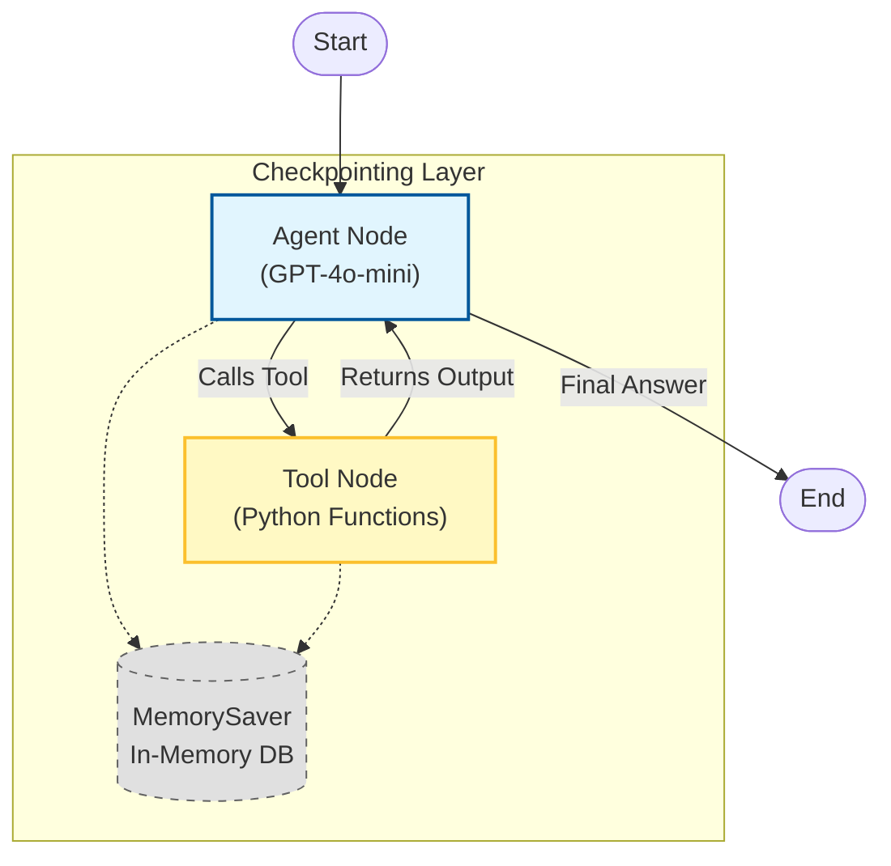

# Topic-3-Agent-Tool-Use
## Task_1
### 1.Sequential Execution
Math Progress: 100%|█████████████████████████████████████████████████████████████████████| 5/5 [00:13<00:00,  2.79s/it]
Facts Progress: 100%|████████████████████████████████████████████████████████████████████| 5/5 [00:03<00:00,  1.64it/s]

Days              : 0
Hours             : 0
Minutes           : 0
Seconds           : 24
Milliseconds      : 870
Ticks             : 248708409
TotalDays         : 0.000287856954861111
TotalHours        : 0.00690856691666667
TotalMinutes      : 0.414514015
TotalSeconds      : 24.8708409
TotalMilliseconds : 24870.8409

### 2.Parallel Execution
Math Progress: 100%|█████████████████████████████████████████████████████████████████████| 5/5 [00:14<00:00,  2.83s/it]
--- Program 1 Finished (5 questions) ---
Facts Progress: 100%|████████████████████████████████████████████████████████████████████| 5/5 [00:13<00:00,  2.77s/it]
--- Program 2 Finished (5 questions) ---

Days              : 0
Hours             : 0
Minutes           : 0
Seconds           : 29
Milliseconds      : 33
Ticks             : 290332529
TotalDays         : 0.000336033019675926
TotalHours        : 0.00806479247222222
TotalMinutes      : 0.483887548333333
TotalSeconds      : 29.0332529
TotalMilliseconds : 29033.2529

## Task_3
============================================================
TEST 1: Weather Tool
============================================================
User: What's the weather like in Tokyo?

--- Iteration 1 ---
LLM wants to call 1 tool(s)
  Tool: get_weather
  Args: {'location': 'Tokyo'}
  Result: Clear, 65°F

--- Iteration 2 ---
Assistant: The weather in Tokyo is clear, with a temperature of 65°F.

============================================================
TEST 2: Calculator (Basic Math)
============================================================
User: What is 153 times 98?

--- Iteration 1 ---
LLM wants to call 1 tool(s)
  Tool: calculate
  Args: {'expression': '153 * 98'}
  Result: {"result": 14994}

--- Iteration 2 ---
Assistant: 153 times 98 is 14,994.

============================================================
TEST 3: Calculator (Geometry)
============================================================
User: Calculate the area of a circle with a radius of 10. (Hint: Use pi * r squared)

--- Iteration 1 ---
LLM wants to call 1 tool(s)
  Tool: calculate
  Args: {'expression': 'pi * 10**2'}
  Result: {"result": 314.1592653589793}

--- Iteration 2 ---
Assistant: The area of the circle with a radius of 10 is approximately \( 314.16 \) square units.

============================================================
TEST 4: Mixed Intent
============================================================
User: If the temperature in San Francisco is X, what is the square root of X?

--- Iteration 1 ---
LLM wants to call 1 tool(s)
  Tool: get_weather
  Args: {'location': 'San Francisco'}
  Result: Sunny, 72°F

--- Iteration 2 ---
LLM wants to call 1 tool(s)
  Tool: calculate
  Args: {'expression': 'sqrt(72)'}
  Result: {"result": 8.48528137423857}

--- Iteration 3 ---
Assistant: The square root of the temperature in San Francisco, which is 72°F, is approximately 8.49.

## Task_4
============================================================
TEST 1: Parallel Execution (Counting Letters)
============================================================

User Query: Are there more 's's than 'i's in the phrase 'Mississippi riverboats'?
--------------------------------------------------
--- Turn 1 ---
LLM Strategy: Calling 2 tool(s)...
  ➜ Executing: count_letter with {'text': 'Mississippi riverboats', 'letter': 's'}
    Result: 5
  ➜ Executing: count_letter with {'text': 'Mississippi riverboats', 'letter': 'i'}
    Result: 5
  (Feeding results back to LLM...)
--- Turn 2 ---

Assistant: In the phrase "Mississippi riverboats," there are 5 's's and 5 'i's. Therefore, there are not more 's's than 'i's; they are equal.     

============================================================
TEST 2: Sequential Chaining (Math + Counting)
============================================================

User Query: Calculate the sine of the difference between the number of 'i's and the number of 's's in 'Mississippi riverboats'.
--------------------------------------------------
--- Turn 1 ---
LLM Strategy: Calling 2 tool(s)...
  ➜ Executing: count_letter with {'text': 'Mississippi riverboats', 'letter': 'i'}
    Result: 5
  ➜ Executing: count_letter with {'text': 'Mississippi riverboats', 'letter': 's'}
    Result: 5
  (Feeding results back to LLM...)
--- Turn 2 ---
LLM Strategy: Calling 1 tool(s)...
  ➜ Executing: calculate with {'expression': 'sin(5 - 5)'}
    Result: 0.0
  (Feeding results back to LLM...)
--- Turn 3 ---

Assistant: The sine of the difference between the number of 'i's and the number of 's's in "Mississippi riverboats" is \( \sin(0) = 0.0 \).       

============================================================
TEST 3: Complex Multi-Step (All Tools)
============================================================

User Query: 1. Get the weather description (e.g. Sunny, Cloudy) for Tokyo. 2. Reverse that word. 3. Count how many times the letter 'r' appears in that reversed word. 4. Calculate that number to the power of 3.
--------------------------------------------------
--- Turn 1 ---
LLM Strategy: Calling 1 tool(s)...
  ➜ Executing: get_weather with {'location': 'Tokyo'}
    Result: Clear, 65°F
  (Feeding results back to LLM...)
--- Turn 2 ---
LLM Strategy: Calling 2 tool(s)...
  ➜ Executing: reverse_text with {'text': 'Clear'}
    Result: raelC
  ➜ Executing: count_letter with {'text': 'Clear', 'letter': 'r'}
    Result: 1
  (Feeding results back to LLM...)
--- Turn 3 ---
LLM Strategy: Calling 1 tool(s)...
  ➜ Executing: calculate with {'expression': '1**3'}
    Result: 1
  (Feeding results back to LLM...)
--- Turn 4 ---

Assistant: 1. The weather description for Tokyo is **Clear**.
2. Reversed, that word is **raelC**.
3. The letter 'r' appears **1** time in **raelC**.
4. Calculating \( 1^3 \) gives **1**.

The final result of the calculations is **1**.

--------------------Discussion--------------------
Test 1 & 2: The output demonstrate parallel tool execution. In Test 1, the LLM recognized that counting 's's and 'i's were independent tasks and issued both count_letter calls simultaneously in a single turn. This reduces the number of round-trips to the LLM and speeds up response time.
output
Test 2: It correctly identified that it could not perform the calculate function until it had retrieved the counts from the count_letter tool. 
Test 3: In the multi-step instruction, the agent showed an interesting optimization strategy. Instead of strictly waiting for the text to be reversed before counting the letter 'r', the agent parallelized these steps in Turn 2. It seemingly understood that the frequency of a letter is invariant to string reversal, allowing it to execute the tasks concurrently for greater efficiency while still arriving at the correct final result.

## Task_5
=== SESSION START: Thread ID 'user_123' ===
User (user_123): Hi, my name is Alice and I am in Tokyo.
--------------------------------------------------
Agent Output: Hi Alice! How can I assist you today?
User (user_123): What is the weather like where I am?
--------------------------------------------------
Agent decides to call: ['get_weather']
  [Tool Executing] Checking weather for Tokyo...
Tool Output generated.
Agent Output: The weather in Tokyo is clear with a temperature of 65°F. Enjoy your day!
=== SYSTEM RESTART / CRASH SIMULATION ===
(Simulating that the script ended and started again...)
=== SESSION RESUME: Thread ID 'user_123' ===
User (user_123): Since I'm in Tokyo, count how many 'o's are in the city name, and tell me if that number is equal to 2 + 1.
--------------------------------------------------
Agent decides to call: ['count_letter']
  [Tool Executing] Counting 'o' in text...
Tool Output generated.
Agent decides to call: ['calculate']
  [Tool Executing] Calculating 2 + 1...
Tool Output generated.
Agent Output: There are 2 occurrences of the letter 'o' in "Tokyo." This number is not equal to \(2 + 1\) (which is 3).

### System Architecture

The following Mermaid diagram illustrates the **cyclic graph** architecture implemented using LangGraph. The system consists of an Agent node (LLM) and a Tools node, connected by conditional edges. State is persisted to a `MemorySaver` checkpointer after every step, allowing for session recovery.

## Task_6
The opportunity lies in parallelizing independent tool calls. In the example, the agent executed the tasks sequentially: it counted the letters first, waited for the result, and then calculated "2 + 1". Since the calculation of "2 + 1" does not depend on the letter count, the Agent should have requested both the count_letter and calculate tools in the very first turn. This would have compressed two separate round-trips into a single execution step, significantly improve efficiency.
